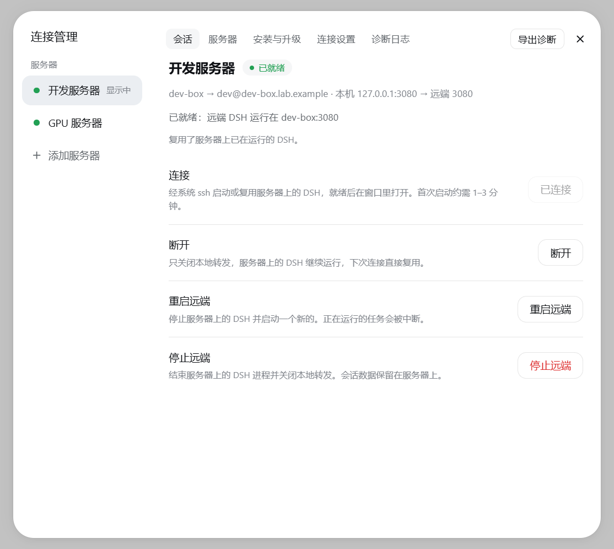
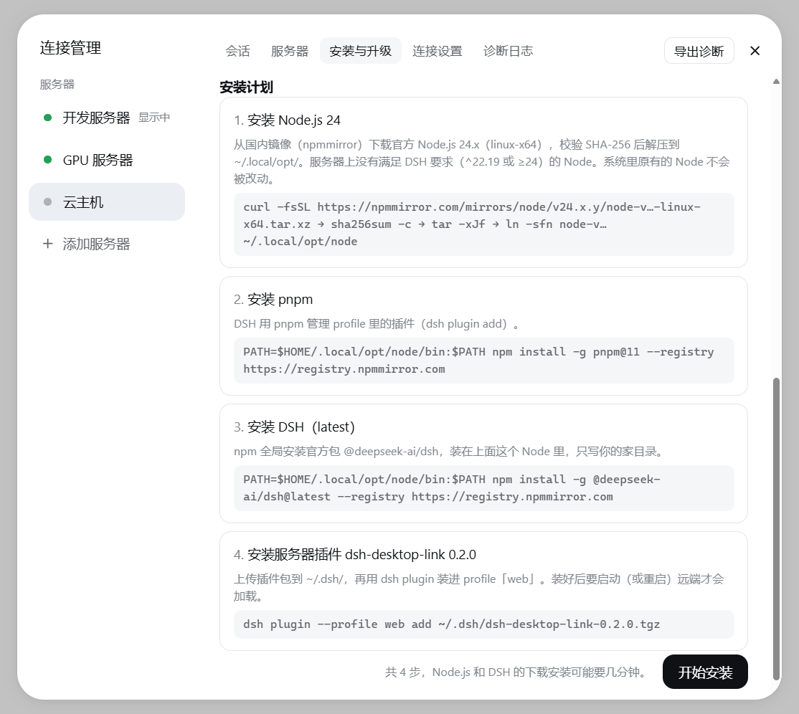
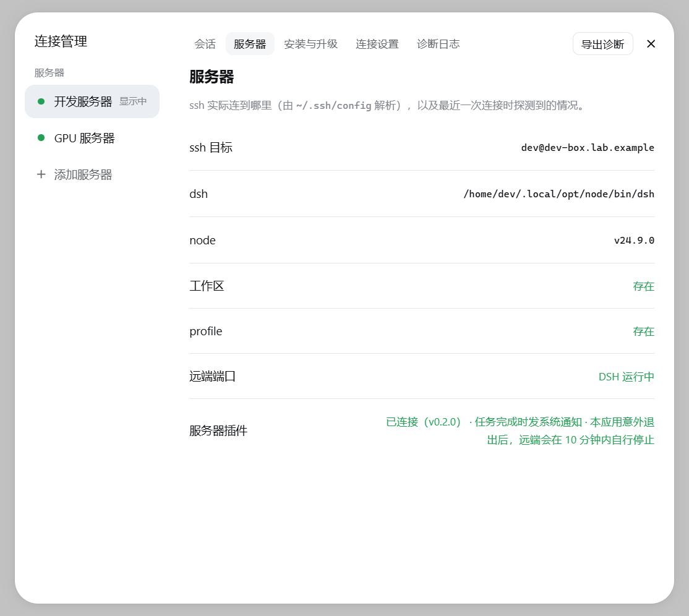
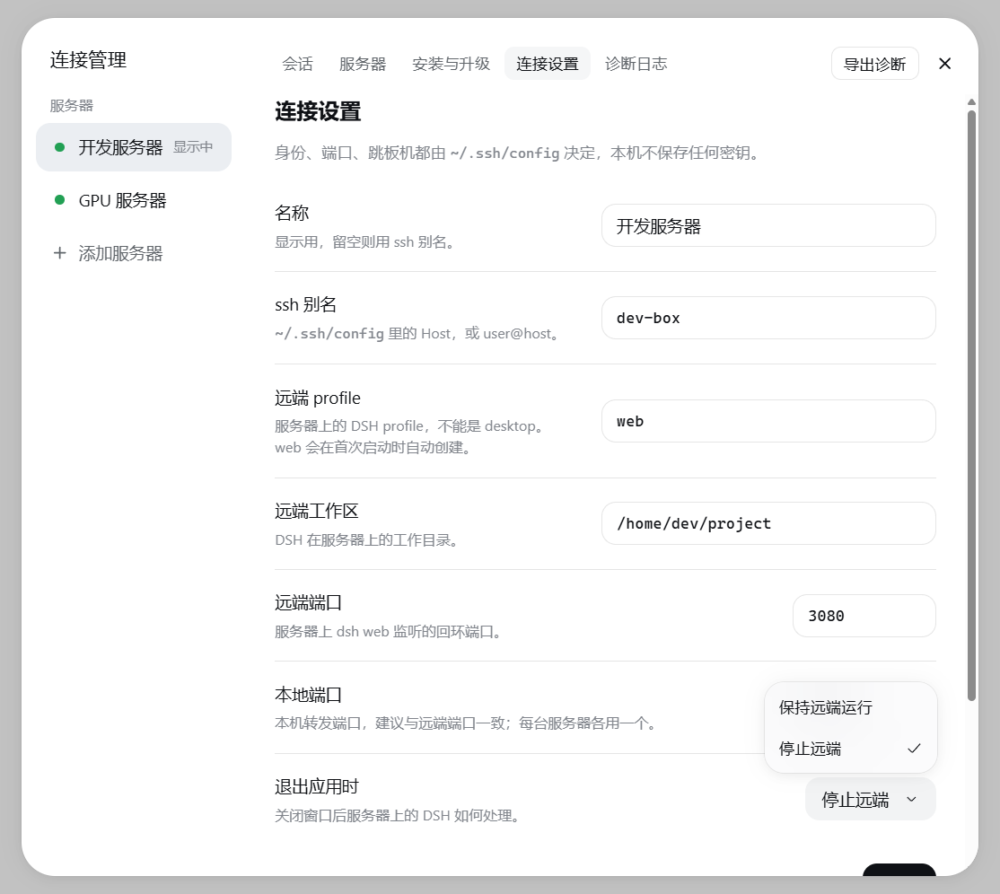

# MedHealthBuddy

在 Windows 上使用**运行在服务器上的** DeepSeek Harness（DSH）。

*A Windows desktop shell for a [DeepSeek Harness](https://github.com/deepseek-ai/deepseek-harness) that runs on a remote server: it starts or reuses `dsh web` there over the system ssh, forwards its port, and shows the remote UI in its own window — with multi-server support, desktop notifications, one-click server install and a companion DSH plugin (`dsh-desktop-link`).*

> **非官方项目。** 本项目是社区开发的第三方工具，与 DeepSeek 没有隶属或背书关系。「DeepSeek」名称归 DeepSeek 所有，这里仅用于标明所连接的软件；如权利人有异议，请提 issue，我会替换。
>
> *Unofficial, community-made tool, not affiliated with or endorsed by DeepSeek. The DeepSeek name belongs to DeepSeek and is used only to identify the software this connects to.*

应用通过系统自带的 ssh 登录服务器，启动或复用那里的 `dsh web`，把它的端口转发到本机，再在自己的窗口里显示 DSH 的界面。DSH、它的 profile、会话和工作区都留在服务器上；本机只负责显示，不运行 DSH，也不保存任何密钥。

- 可以同时连接多台服务器，在窗口里切换
- 远端任务完成时弹出 Windows 通知，任务栏显示角标
- 会话顶部有「VS Code」按钮，通过 Remote-SSH 打开会话所在的目录
- 能在服务器上一键安装或升级 DSH 和配套插件，只写入你的家目录，不需要 root
- 断线或电脑睡眠唤醒后自动重连；可以选择退出应用时是否停止远端 DSH

## 截图

<table>
  <tr>
    <td width="50%"></td>
    <td width="50%"></td>
  </tr>
  <tr>
    <td align="center">多台服务器，状态一目了然</td>
    <td align="center">一键安装 Node.js、DSH 和配套插件，每一步先列出来再执行</td>
  </tr>
  <tr>
    <td width="50%"></td>
    <td width="50%"></td>
  </tr>
  <tr>
    <td align="center">连接前自动探测服务器环境和插件状态</td>
    <td align="center">每台服务器单独设置，身份和跳板机交给 ~/.ssh/config</td>
  </tr>
</table>

*截图中的服务器名和地址均为示例。*

## 安装

运行 `MedHealthBuddy-Setup-<版本>.exe`。默认只为当前用户安装，不需要管理员权限，也可以在安装时更改安装位置。

安装包**没有数字签名**，第一次运行时 Windows SmartScreen 可能提示「Windows 已保护你的电脑」。点「更多信息」，再点「仍要运行」即可。

## 准备

1. **ssh 能免密登录服务器。** 应用用的是 Windows 自带的 OpenSSH（`C:\Windows\System32\OpenSSH\ssh.exe`），读取你的 `%USERPROFILE%\.ssh\config`。建议在里面为服务器写一个 Host 别名，身份文件、端口、跳板机也都写在那里。先在终端里确认 `ssh <别名>` 能直接登录，不用输入密码或确认主机指纹。
2. **服务器上有 DSH。** 如果还没有，添加服务器后在「连接管理 → 安装与升级」里检查一下，按提示一键安装：Node.js、pnpm、DSH 和配套插件 dsh-desktop-link 会装进 `~/.local/opt` 和 `~/.dsh`。

## 使用

1. 打开应用，在「应用 → 连接管理 → 添加服务器」里填写 ssh 别名和服务器上的工作目录，然后保存。
2. 点「连接」。第一次启动远端 DSH 通常要 1–3 分钟，之后再连接会直接复用，只需几秒。
3. 连接后，窗口里的操作和在浏览器里用 DSH 完全一样。窗口左上角的「应用」菜单可以切换服务器、打开连接管理、测试通知。
4. 点窗口右上角的 × 不会退出，只会收起到任务栏右下角的通知区域（托盘）：连接照常保持，任务完成照常通知。单击托盘图标可以重新打开窗口；要真正退出，在托盘图标的右键菜单或「应用」菜单里选「退出」。

### 退出应用时

在每台服务器的「连接设置」里选择：

- **保持远端运行**（默认）：服务器上的 DSH 继续运行，下次打开应用直接接上，正在跑的任务不受影响。
- **停止远端**：正常退出时停止服务器上的 DSH。如果应用被强制结束、崩溃或长时间断网，远端会在约 10 分钟后自行停止。这需要服务器上装有配套插件。

## 数据与日志

| 内容 | 位置 |
|---|---|
| 服务器列表 | `%APPDATA%\MedHealthBuddy\connections.json` |
| 各服务器的登录状态（cookie） | `%APPDATA%\MedHealthBuddy\Partitions\` |
| 日志 | `%APPDATA%\MedHealthBuddy\logs\main.log`（超过 1 MB 轮换为 `main.old.log`） |

所有目录都叫 MedHealthBuddy：默认安装位置是 `%LOCALAPPDATA%\Programs\MedHealthBuddy`，安装程序自己的副本放在 `%LOCALAPPDATA%\MedHealthBuddy\updater`。更早版本的旧目录（`%APPDATA%\dsh-ssh-desktop` 和 `%APPDATA%\DSH SSH Desktop`）会在第一次启动时自动搬到新位置。

日志和「连接管理 → 导出诊断」生成的文件都会去掉启动令牌和连接密钥，可以直接附在问题报告里。卸载时这些数据会保留；如果不再需要，删除 `%APPDATA%\MedHealthBuddy` 即可。

## 开发

```sh
pnpm install
pnpm test                                        # 三个包的全部测试
pnpm --filter medhealthbuddy-desktop run package        # 生成安装包，输出到 dist/installer/
pnpm --filter medhealthbuddy-desktop run icon           # 重新生成图标（assets/）
```

仓库结构：

- `packages/core`：连接引擎（ssh、远端启动、端口转发、服务器安装），纯 Node，不依赖 Electron
- `packages/desktop`：Electron 桌面端
- `packages/server-plugin`：服务器端配套插件 dsh-desktop-link（握手、租约、任务完成通知、VS Code 按钮）

开发时运行 `start-desktop.cmd`；第一次使用前先运行 `setup-electron-runtime.cmd`，原因见脚本里的说明。
